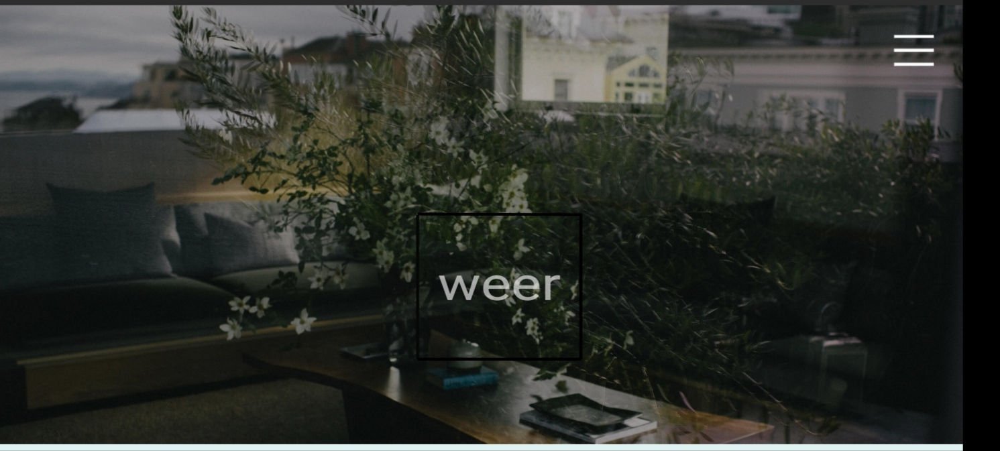

<html class="no-js" lang="en">

<head>
    <meta charset="utf-8">
    <meta http-equiv="X-UA-Compatible" content="IE=edge">
    <meta name="viewport" content="width=device-width, initial-scale=1">
    <title>My Portfolio</title>
	<link rel="shortcut icon" href="favicon.ico" type="image/x-icon">
	<link rel="icon" href="favicon.ico" type="image/x-icon">
    <link href="https://fonts.googleapis.com/css?family=Lato:300,400,700,900" rel="stylesheet">
    <link rel="stylesheet" href="libs/font-awesome/css/font-awesome.min.css">
    <link href="css/bootstrap.min.css" rel="stylesheet">
    <link href="css/styles.css" rel="stylesheet">
</head>

  

 <h1 align="center">
  <h2 align="center">You can reach me on: </h2>

  

  

  

  <a href="https://m.me/wai.waiyan.3">
    
    
  
  
  
  
  </a>
  
  

</h1>

  &nbsp;&nbsp;

  &nbsp;&nbsp;

<h1 align="center"></h1>

 
 
<h2 font-weight="bold">𝐒𝐤𝐢𝐥𝐥 𝐒𝐞𝐭</h2>
<table>
  <tr>
      <td></td>
      <td></td>
      <td></td>
      <td></td>
      <td>
    </td>    
  </tr>
  <tr>
    <td></td>
    <td></td>
    <td></td>
    <td></td>
    <td></td>
  </tr>
  <tr>
    <td></td>
    <td></td>
    <td></td>
    <td></td>
    <td></td>
    <td></td>
    
  </tr>

</table>

        <h2 class="heading">Education</h2>
        

            <h3>University of Yadanabon</h3>
            Sept 2010 - Sept 2011
            <h4>2nd of Biochemistry </h4>
            

                Lorem ipsum dolor sit amet, consectetur adipiscing elit. Curabitur in iaculis ex. Etiam volutpat laoreet urna. Morbi ut tortor nec nulla commodo malesuada sit amet vel lacus. Fusce eget efficitur libero. Morbi dapibus porta quam laoreet placerat.
            

        

        <!-- End .education-block -->

    <!-- End #education -->
    

        <h2 class="heading">Projects</h2>
        

            

                

                    

                        
                    

                    <!-- End .project-image -->
                    

                        <h3>MATRiX E-COMMERCE</h3>
                        

                            Lorem ipsum dolor sit amet, consectetur adipiscing elit. Curabitur in iaculis ex. Etiam volutpat laoreet urna. Morbi ut tortor nec nulla commodo malesuada sit amet vel lacus. Fusce eget efficitur libero. Morbi dapibus porta quam laoreet placerat.
                        

                        <a href="https://matrixecommerce.cu.ma/">View Project</a>
                    

                    <!-- End .project-info -->
                

                <!-- End .project -->

                

                    

                        
                    

                    <!-- End .project-image -->
                    

                        <h3>WEER - Architecture</h3>
                        

                            Lorem ipsum dolor sit amet, consectetur adipiscing elit. Curabitur in iaculis ex. Etiam volutpat laoreet urna. Morbi ut tortor nec nulla commodo malesuada sit amet vel lacus. Fusce eget efficitur libero. Morbi dapibus porta quam laoreet placerat.
                        

                        <a href="https://weer-studio.vercel.app/">View Project</a>
                    

                    <!-- End .project-info -->
                

                <!-- End .project -->
            

        

    

    <!-- End #projects -->
<table>
  <b>When I work</b>
   

</table>

<b>I'm a Developer and IT Consultant I work with the goal of learning and solving problems digitally</b>

